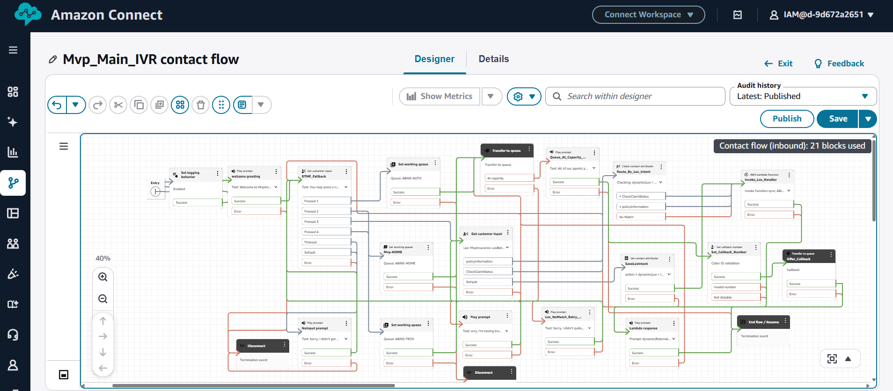
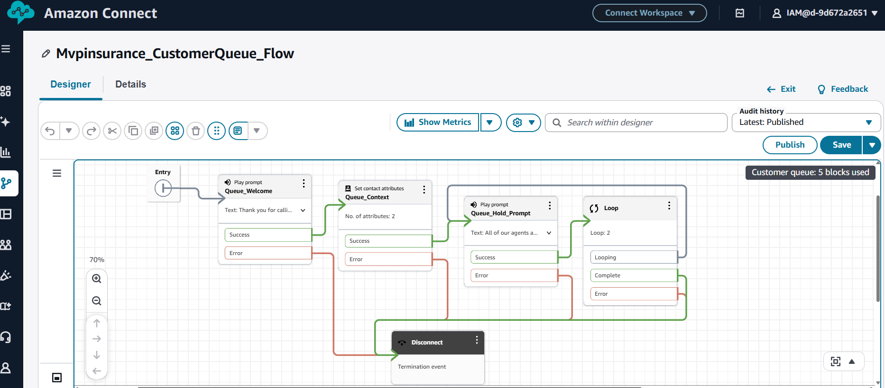
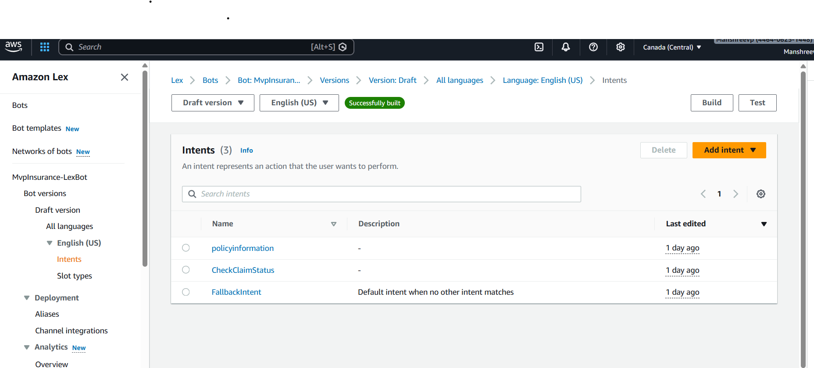
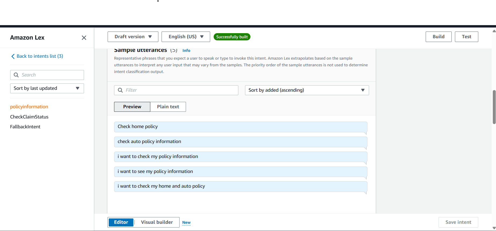
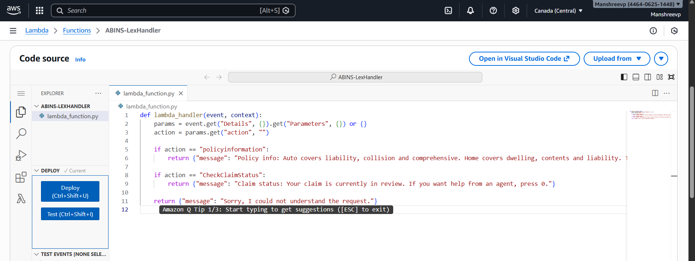
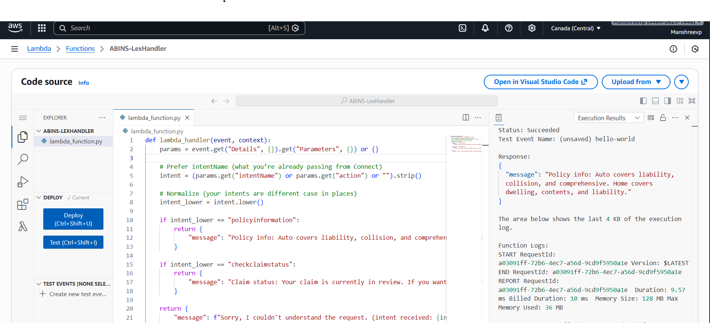
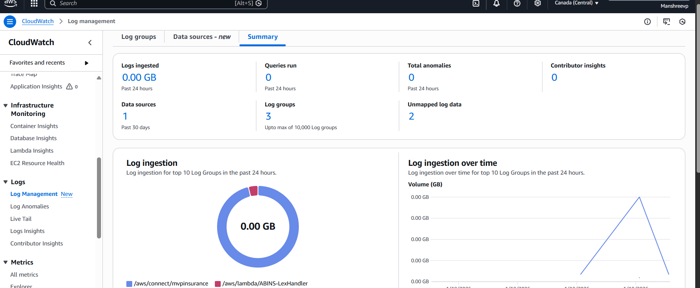
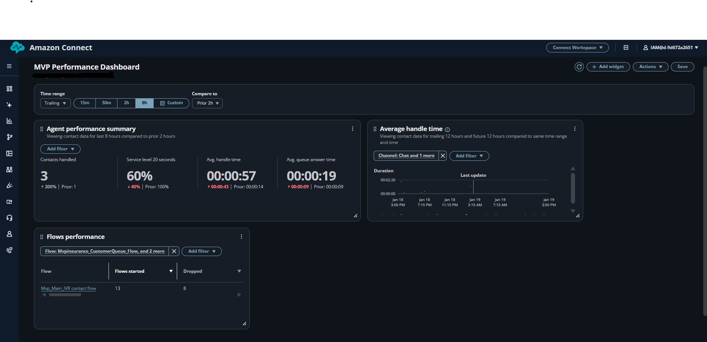
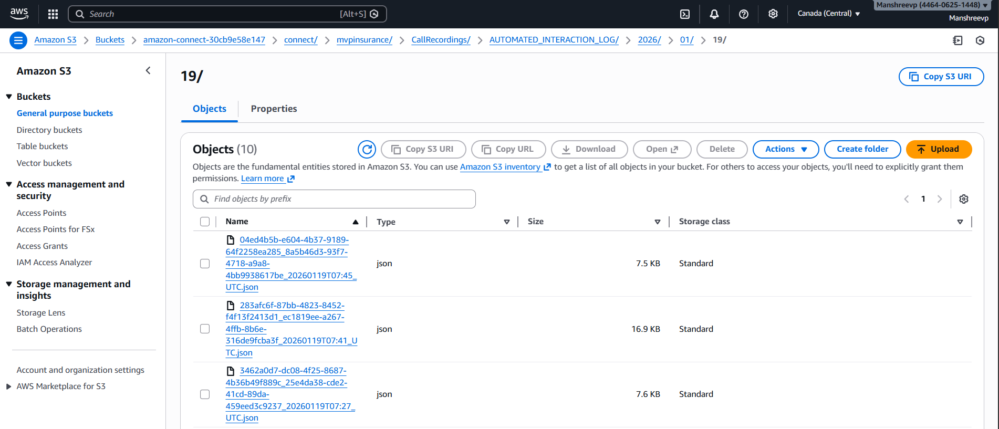

# 📞 Insurance Contact Center – Amazon Connect MVP

An Amazon Connect contact center MVP built for an insurance use case.
This project demonstrates end-to-end IVR design, DTMF and voice routing, Amazon Lex integration, Python (Lambda) business logic, monitoring, and operational visibility.

This solution reflects hands-on experience designing, configuring, testing, and operating Amazon Connect workflows, with a focus on real-world contact center behavior rather than demo-only flows.

---
🏗 High-Level Call Flow (Logic First)

Customer calls Insurance Support
        ↓
Amazon Connect Entry Point
        ↓
Welcome Prompt (Voice + DTMF)
        ↓
DTMF OR Amazon Lex (Voice Intent)
        ↓
Lambda (Python business logic)
        ↓
Correct Queue (Auto / Home / Claims / Tech)
        ↓
Agent Workspace
        ↓
Call Recording + Metrics + Logs

This architecture intentionally supports both keypad-based and voice-based callers, which is critical for insurance contact centers where caller preferences vary.

🧠 Core Amazon Connect Logic (Detailed)

1️⃣ Entry Point & Logging

Call enters Amazon Connect contact flow

Flow logging enabled immediately for traceability

Ensures all execution steps are visible in CloudWatch Logs.

2️⃣ Welcome Prompt + Menu Design

Customer hears a structured welcome message

Options available via:

DTMF (keypad)

Voice (Amazon Lex)

This design avoids hard dependency on voice only (common real-world requirement).

3️⃣ DTMF Routing (Fallback-Safe Design)

Key presses route directly to queues:

1 → Auto Insurance

2 → Home Insurance

3 → Claims (Lex-enabled path)

4 → Technical Support

Handles:

No input | Invalid input |Timeouts

This ensures callers never get stuck.

4️⃣ Amazon Lex (Voice Intent Handling)

Lex is used only where voice adds value (Claims & Policy queries).

Lex V2 bot trained with intents:

- CheckClaimStatus
- PolicyInformation

Lex collects intent → passes context to Lambda

Contact flow evaluates $.Lex.IntentName

5️⃣ Python Lambda (Business Logic)

Lambda is where decision-making happens, not in the IVR.

Written in Python

Receives intent from Lex

Performs logic based on intent type

Returns structured responses back to Amazon Connect

This separation keeps:

Contact flows readable | Business logic version-controlled

6️⃣ Queue Routing & Agent Experience

Calls are routed to insurance-specific queues | Routing profiles ensure correct agent selection | Agent Workspace shows real-time call context

7️⃣ Queue Capacity & Callback Handling

If a queue is full:

Customer is offered a callback

Callback number is captured dynamically

Prevents excessive wait times

📊 Monitoring, Logs & Operations (Very Important)

CloudWatch Logs

Contact flow execution logs

Lamada invocation logs

Enables post-incident analysis

CloudWatch Metrics & Dashboards

Queue depth | Agent availability | Call performance |Real-time operational visibility

🔐 IAM & Security

Separate IAM roles for:

Amazon Connect | Lex | Lambda |Permissions scoped to least privilege

### Main Contact Flow

The core IVR logic is implemented using an Amazon Connect contact flow,
supporting DTMF input, Lex-based voice intent routing, error handling,
and callback logic.

 Customer Queue / Wait Experience

Lex Bot + Intent Configuration

Lambda (Python) 
Business logic is implemented in Python using AWS Lambda.  
Lex intents are passed to Lambda for processing and dynamic responses
are returned back to the contact flow.

Lambda (Python) – Handler + Execution

CloudWatch Monitoring (Metrics + Dashboard)

S3 Call Recording Bucket (Artifacts)

📂 Repository Structure
Insurance-AmazonConnect-Mvp/
├── contact-flows/
│   └── mvp_main_contactflow.json
│
├── lambda/
│   └── lex_handler.py
│
├── docs/
│   ├── (all screenshots & proofs)
│
└── README.md

🎯 Key Skills Demonstrated

Amazon Connect IVR design

DTMF + voice hybrid routing

Amazon Lex V2 integration

Python (Lambda) development

CloudWatch monitoring & troubleshooting

Contact center operational thinking

## 📸 Screenshots

The `docs/` folder contains supporting screenshots that demonstrate the design,
configuration, and operational behavior of the Amazon Connect contact center.

| File | Description |
|-----|------------|
| `agent_profile.png` | Example of an agent profile view in Amazon Connect. |
| `agent_workspace.png` | Connect agent workspace showing call details and controls. |
| `amazon_lex.png` | Amazon Lex V2 configuration screen showing intents and slots. |
| `callback_flow.png` | Contact flow logic for handling callback offers. |
| `cloudwatch1.png` | Sample CloudWatch dashboard showing call metrics. |
| `connect.png` | Entry point to the Amazon Connect instance. |
| `contactsearch.png` | Searching contacts within the Amazon Connect console. |
| `cw_api.png` | CloudWatch metrics view for API usage. |
| `cw_g.png` | Generic CloudWatch metrics for Connect. |
| `cw_metric.png` | CloudWatch metric chart illustrating call performance. |
| `cw_metric2.png` | Additional CloudWatch metric for deeper analysis. |
| `cw_metric3.png` | Extended CloudWatch performance metric. |
| `cw_summary.png` | Consolidated CloudWatch dashboard summary. |
| `iam_lex.png` | IAM policy configuration granting Lex permissions. |
| `iam_lextest.png` | Testing IAM permissions for Lex bot integration. |
| `iam_role.png` | IAM role associated with Connect / Lambda. |
| `lambda_overview.png` | Overview of the Lambda function configuration. |
| `lambda_exe.png` | Lambda execution and runtime configuration. |
| `lex_bot.png` | Summary view of the Lex bot and configured intents. |
| `lex_intent.png` | Detailed configuration of a Lex intent. |
| `live_call.png` | Example of a live call in progress in Amazon Connect. |
| `logstream.png` | CloudWatch log stream showing execution logs. |
| `logstream1.png` | Additional CloudWatch log stream view. |
| `metric1.png` | Supplemental CloudWatch metric chart. |
| `mvp_customerqueue.png` | Customer queue configuration for the MVP. |
| `mvp_main_contact_flow.png` | Main Amazon Connect contact flow used in this project. |
| `performance_dashboard.png` | Performance dashboard showing key call-center KPIs. |
| `prod_lex.png` | Production alias configuration for the Lex bot. |
| `real_time_agent_metrics.png` | Real-time agent metrics dashboard in Amazon Connect. |
| `routing_profile.png` | Routing profile mapping agents to queues. |
| `s3_connect.png` | S3 bucket used for Connect artifacts and recordings. |
| `s3_connect_recordingbucket.png` | S3 recording bucket configuration for call recordings. |

## Future enhancement

The current implementation is intentionally minimal.  To extend it:

- Add more intents to the Lex bot for other self‑service scenarios such as “make a payment” or “update address”.
- Integrate the Lambda handler with external APIs or databases to return live policy or claim information.
- Use **Amazon Connect Tasks** to follow up with customers asynchronously.

### Contributions are welcome!  Feel free to fork the repository and submit pull requests for enhancements.

🚀 Why This Matters: 

This project is not a demo flow — it reflects how real insurance contact centers are designed, monitored, and supported using Amazon Connect.

👤 Author: Manshree Patel
🎯 Focus: Amazon Connect | AWS | Serverless
